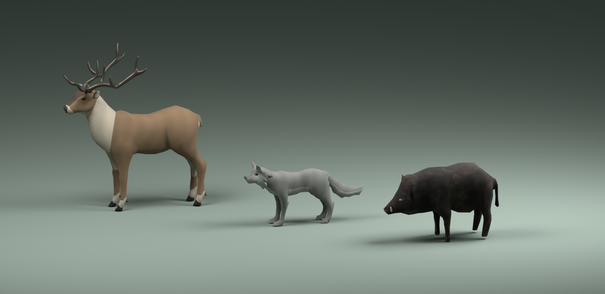

# 第二阶段动物骨骼资源

> 本文保留模块设计、接入约定与交接时的验证边界；整体已完成接入，当前真实浏览器与最终验证结果见 [第二阶段验收](ACCEPTANCE.md)。

此子任务只交付动物资源、动画接口与资产验证。游戏中的生成、AI、战斗、碰撞、角色生命周期和实际验收由父任务集成。

## 已采用的原作者资源

| 动物 | 原作者 / 来源 | 授权与原始动作 |
|---|---|---|
| 鹿（雄鹿 Stag） | [Quaternius · Ultimate Animated Animal Pack](https://quaternius.com/packs/ultimateanimatedanimals.html) | CC0；38 joints；作者原有 Idle、Walk、Gallop、Headbutt、Kick、HitReact、Death、Eating、Jump |
| 狼 | [Quaternius · Ultimate Animated Animal Pack](https://quaternius.com/packs/ultimateanimatedanimals.html) | CC0；51 joints；作者原有 Idle、Walk、Gallop、Attack、HitReact、Death、Eating、Jump |
| 野猪 | [Teh_Bucket · Boar](https://opengameart.org/content/boar) | CC0；32 joints；作者原有 walk、attack 与中立姿态；旧版 Blender 源文件附 1024px 手绘毛色纹理 |

Quaternius 的[作者发布说明](https://www.patreon.com/quaternius/posts/ultimate-animals-53427821)确认可用于商业项目，并链接本次下载使用的公开 Drive 文件夹。鹿和狼直接取自该作者文件夹。Teh_Bucket 页面明确标注 CC0、骨骼、纹理和步行/攻击动画，直接提供本次使用的 `.blend`。

`public/assets/animals/manifest.json` 记录直接下载地址、作者页面、原始文件 SHA-256、输出 GLB SHA-256、实际三角形数量、每段动作时长及修改说明。`LICENSE.txt` 提供随资产分发的简明授权索引。

鹿、狼保留原作者低面数造型，优化了毛色饱和度、连贯表面法线和细毛纹理；鹿夸张的浅色眼圈改为自然毛色，黑色眼部几何保留。野猪保留原作者身体轮廓、獠牙、毛色与真实多节四足骨骼。它们比原来的球体/圆柱组合具有明确解剖结构和动作过程，但本子任务不把这些资源称为写实扫描动物。



上图使用最终 GLB 进行 CPU 离线渲染，用来核对轮廓、材质、UV 和比例。它不是游戏截图，不能代替父任务的实机动画验收。

## 尺度与方向：避免二次缩放

**GLB 内部已经包含全部尺度转换。外层 `rig.root.scaling` 必须保持 `(1, 1, 1)`。**

- 模型运行时统一 **+Z 朝前、+Y 朝上、米制、y = 0 对应站立脚底平面**，默认脚底误差小于 5 mm。
- `profile.sourceScale` 为处理源模型时使用的倍率：鹿 `.43`、狼 `.34`、野猪 `.5`。这些倍率已经存在于 GLB 内部 `AnimalScaleRoot`，**不能再次乘到外层 root**。
- `profile.scale` 是保留的兼容别名，也仅是离线来源倍率。`profile.runtimeScale` 明确为 `1`。
- **不要再乘旧 `ENEMIES.size`**。旧狼 `.8`、野猪 `.85` 是旧球柱模型的造型倍率，不适用于本资源。
- 外层 root 只接收 `actor.position` 与 `actor.yaw`；无需再补 180° 朝向修正。

| 动物 | 站立整体尺寸约值（宽 × 高 × 长） | 备注 |
|---|---|---|
| 鹿 | 1.09 × 2.32 × 2.08 m | 宽、高包括鹿角；头部骨骼约 y = 1.63 m |
| 狼 | .36 × .91 × 1.79 m | 包括尾巴；头部骨骼约 y = .72 m |
| 野猪 | .64 × 1.08 × 1.71 m | 头部骨骼约 y = .66 m |

完整包围盒在每种动物的 `profile.bounds`。

## 动作接口

统一动作名称为 `Idle`、`IdleLook`（有源动作时）、`Walk`、`Run`、`Attack`、`Hit`、`HitAlt`、`Death`；鹿、狼另保留 `Eat`、`Jump`，鹿保留 `Kick`。

| 动物 | Idle | Walk | Run | Attack | Hit / HitAlt | Death | Attack hitPhase |
|---|---:|---:|---:|---:|---:|---:|---:|
| 鹿 | 3.333 s | 1.167 s | .533 s | .800 s | .467 / .533 s | 1.100 s | .46 |
| 狼 | 3.333 s | 1.067 s | .567 s | 1.333 s | .667 / .667 s | 1.067 s | .30 |
| 野猪 | 3.000 s | 1.333 s | .733 s | .633 s | .420 / .460 s | 1.050 s | .40 |

`hitPhase` 是从原动作蓄力、头部/獠牙接触、恢复过程采样后标定的源动作归一化位置。`animalAttackPhase()` 使用分段连续映射，把该姿态精确对齐到现有 `ActorAttack.hitTime`。因此 AI 攻击总时长改变时，不必修改资产时间轴，也不会把伤害事件复制到渲染层。

野猪的动作来源需要明确区分：

- `Walk` 与 `Attack` 为原作者动画，Blender IK 约束已烘焙为四足关节轨道。
- `Run` 是作者 Walk 的 .55 时长版本，用于快速小跑；不宣称它是独立捕获的四足飞奔动作。
- `Idle` 基于作者中立姿态，补轻微胸部呼吸、头部活动。
- `Hit` / `HitAlt` 为本项目制作的方向性躯干与头部短促反应。
- `Death` 为本项目制作的侧倒、关节收腿和落地过程。

鹿、狼的核心动作保持原作者设计。鹿原死亡动作会让鹿角深入地面，本次烘焙了保持鹿角刚性附着的头颈姿态修正，随后为三种动物烘焙平地落地校正。步行、奔跑和受击中仅补偿负脚底高度，保留原来的抬腿与腾空。

**`deathGrounding` 和 `hoofGrounding` 仅是离线审计数据。校正已经写进 `*-motion.glb` 的关节或 `AnimalActionRoot` 轨道，运行时不得再次加 y 偏移。**

## 父任务接入方式

使用 `src/rendering/animal-assets.ts`：

```ts
const animals = new AnimalAssetLibrary(scene);
await animals.preload("wolf", "high");
const rig = animals.instantiate(actor.id, "wolf", "high");

// 每帧：位移和朝向继续由现有 simulation 决定。
rig.root.position.set(actor.position.x, actor.position.y, actor.position.z);
rig.root.rotation.y = actor.yaw;
rig.root.scaling.setAll(1);
updateAnimalAnimation(rig, actor, sim.state.elapsed, dt, distanceToPlayer);
```

`AnimalRig` 提供 `root`、`meshes`、`nodes`、`animator`、`head`、`feet`、`profile` 与 `dispose()`。公共形状包含现有 `AnimatedRig` 的核心字段，因此可以作为角色 skin 使用。`feet` 是源骨架最下级肢骨的采样锚点，不是额外制造的脚底 IK 目标；完整多节肢体仍可从 `nodes` 获取。

`updateAnimalAnimation()`：

1. 保持 AI 所有权，不修改速度、位移、伤害或状态。
2. 按生命值、攻击、受击、移动和进食选择对应动作。
3. 用 `gaitPhase` 同步 Walk/Run 混合，攻击接触姿态对齐 `hitTime`。
4. 死亡动作在末帧保持，不循环回站立。
5. 0–28 m 每帧采样；28–75 m 最高 24 Hz；75 m 以外最高 10 Hz。

调用后不要再对该动物应用旧的统一四足正弦或旧整体翻倒逻辑，否则会叠加两套动画。保留角色总更新流程对外层 root 的位置、yaw、可见性及交互管理。

按物种按需加载：`preload(kind, lod)` 只获取对应物种的共享 motion 和该档 mesh。切换 LOD 只增加另一档 mesh 请求。`ready()`、`pending`、`failures` 可用于现有加载诊断。一个物种的多个实例共享原始资源，但拥有独立克隆骨架；销毁角色调用 `rig.dispose()`，销毁场景调用 `animals.dispose()`。

## 资源预算

9 个 GLB 总计 **1,497,612 bytes**，另有小型 JSON/许可文件。

| 动物 | Motion | High（三角形 / bytes） | Low（三角形 / bytes） | 第一次 High 加载 |
|---|---:|---:|---:|---:|
| 鹿 | 346,656 B | 3,670 / 143,608 B | 3,146 / 117,312 B | 490,264 B |
| 狼 | 434,036 B | 1,962 / 106,056 B | 1,465 / 76,936 B | 540,092 B |
| 野猪 | 132,596 B | 1,144 / 85,812 B | 914 / 54,600 B | 218,408 B |

高档鹿/狼微观毛色纹理为 256px，野猪为 512px，低档最多 128px。资源使用标准 glTF skin / animation，未增加运行时压缩解码器。低档保守保留关节权重和细角几何，因此真实减面幅度小于请求的 Meshopt ratio；表内记录的是实际产物。

## 可复现处理与验证

运行 `node scripts/prepare-animals.mjs`。源文件缓存在系统临时目录 `ashfall-animal-sources`；首次转换野猪 `.blend` 需要 `ASHFALL_BPY_PYTHON` 指向装有 `bpy 4.5` 的 Python 3.11。该转换工具属于离线工具环境，没有加入项目 package.json 或运行时依赖。

本机调用示例：

```sh
ASHFALL_BPY_PYTHON=/tmp/ashfall-animal-tools/bin/python node scripts/prepare-animals.mjs
```

旧野猪源有两个容易静默产生错误的条件，脚本已明确处理：应用原始 Mirror / EdgeSplit / Triangulate 修饰器但保留 Armature；材质显式使用作者最终的 `UVMap`，避开旧的 `projection-test` 层。否则会出现半身模型或大块错误毛色。验证过转换后的左右身体、UV 与实际形状。

`npx vitest run tests/phase2-animal-assets.test.ts` **4 / 4 通过**，包括真实 Babylon importer、独立骨架、多实例隔离、四肢实际运动、+Z 朝向、完整左右模型、皮肤权重归一化、文件 hash 与 1.6 MB 预算、连续死亡时鹿角和躯体不穿地、AI 命中时刻映射。完整 TypeScript 和目标 ESLint 检查通过。

父任务仍须在游戏中验收鹿逃跑、狼追击与扑咬、野猪冲撞、命中与死亡、地形起伏、LOD 切换和加载期间的可见性。离线平地校正不替代坡地 IK，也不代表整体第二阶段已完成。
