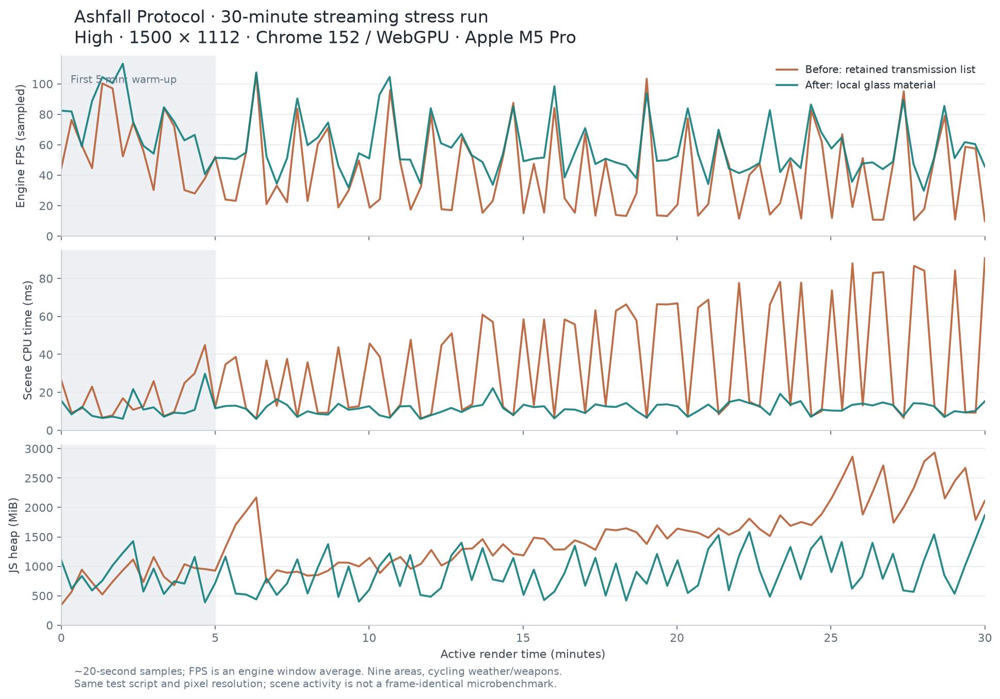

# 最终连续运行与性能记录

日期：2026-09-09。候选 `586f284659e78bb8`，运行源码 SHA-256 `3350fb782e8e6c78f219d076459b5d5f68bba015c0c9ab7c84479864c15b8a37`。本记录保留第一次长测发现的真实退化，并使用修复后的完整第二次长测核验。

指标正文由脚本生成，稳定性判断与全阶段结论见 [最终验收](ACCEPTANCE.md)。

## 测试条件

- 本机 `Mac17,8`、Apple M5 Pro、48 GiB RAM（sysctl 实际读回）；浏览器 UA 的 Intel 字符串是兼容 UA，不能用它判断硬件。
- Chrome 152 / WebGPU / High，实际渲染分辨率 `1500 × 1112`。
- UTC `2026-09-09T00:10:01.693Z` 至 `2026-09-09T00:40:11.546Z`；墙钟 1809.80 秒，有效渲染运行 1800.02 秒，112,974 帧、65 次场景位置切换、91 个采样点。
- 松谷、城市、军事、工业、湖岸、矿场、研究站、广播站和地下循环；六种武器、ADS/装填、昼夜/五种天气、手电、正常世界人口、声音与每两分钟保存。
- 使用开发自动操作、旅行、无敌和供弹，不强制新增敌人。它检查长期资源/渲染/模拟稳定性，不证明生存资源平衡；正常伤害生存链路另测。
- 世界模拟累计 1793.59 秒。游戏单帧模拟 dt 上限 50 ms，有效长测计时上限 100 ms，因此它们不会在低帧率/加载帧上与墙钟完全相等。

## 发现、修复与复核

首次 30 分钟虽无 JS 错误，却不能通过性能验收：结束时约 10 FPS，堆回收低点增长。CPU profile 指向 ObjectRenderer 的准备/提交；实际 `opaqueSceneTexture` 含 137,138 个网格，其中 135,992 个已销毁。发电机一块玻璃的 glTF transmission 扩展启用了跟踪全场景网格的 helper，已卸载网格仍被保留。仅清理该列表的诊断实验使同场景 CPU 从约 93 ms 降至 27 ms。

修复将环境 GLB 统一经过 `loadEnvironmentAsset()`，关闭自动 transmission helper，小块玻璃使用 alpha 与 clear coat。没有降低全局画质、删掉敌人或缩短长测。真实 GLB 导入/销毁回归已加入，共 180 项测试通过。

第二次长测捕获错误 **0**、警告 **0**，所有 worldError 为空；自动正常结束。渲染目标中 transmission pass 数为 **0**，采样到的已销毁网格最大数为 **0**。音频加载失败 **0**，一次性声部最大 19、循环声最大 4。

## 采样数据

以下排除最初五分钟预热，分别为各采样值的 **最小 / 中位 / 最大**，不是所有帧的全量分布。

| 指标 | 修复前 | 修复后 |
| --- | ---: | ---: |
| FPS | 9.891 / 29.061 / 106.496 | 29.827 / 51.256 / 107.488 |
| 最近 600 帧 P95（ms） | 11.1 / 57.95 / 102 | 10.3 / 20.75 / 25.2 |
| 最近 600 帧 P99（ms） | 11.7 / 70.35 / 112.7 | 10.8 / 22.45 / 38.9 |
| draw calls | 336 / 1337 / 2678 | 345 / 1248.5 / 1878 |
| GPU 主渲染 pass（ms） | 0.393 / 3.506 / 6.357 | 0.393 / 3.801 / 5.374 |
| scene CPU（ms） | 6.1 / 24.9 / 90.7 | 6 / 12.25 / 22.2 |
| 动画阶段（ms） | 0 / 0.5 / 0.8 | 0 / 0.3 / 0.7 |
| 模拟（ms） | 0.7 / 2.5 / 5.5 | 0.8 / 2.4 / 5.7 |
| 每帧碰撞查询 | 58 / 181 / 284 | 65 / 179 / 261 |
| Mesh | 901 / 1162 / 1259 | 924 / 1154 / 1267 |
| Material | 374 / 376 / 380 | 375 / 376 / 380 |
| Texture | 482 / 502 / 513 | 476 / 496 / 504 |
| Geometry | 942 / 1039 / 1265 | 947 / 1036.5 / 1265 |
| 实际呈现 actor rig | 8 / 28 / 38 | 8 / 29 / 35 |
| AnimationGroup | 392 / 1210.5 / 1607 | 375 / 1230.5 / 1469 |
| JS heap（MiB） | 720 / 1500.5 / 2934 | 399 / 868.5 / 1868 |

整个墙钟运行的平均已呈现帧率：修复前 **43.68 FPS**，修复后 **62.42 FPS**。区域、天气和角色行为并非每一帧严格相同，不能把两次运行当成逐帧同负载的微基准。

| 时间段 | 修复前 FPS 采样中位 | 修复后 FPS 采样中位 | 修复前 heap MiB | 修复后 heap MiB |
| --- | ---: | ---: | ---: | ---: |
| 0–5 分钟 | 55.96 | 75.17 | 344–1159 | 387–1427 |
| 5–10 分钟 | 33.16 | 52.33 | 720–2170 | 399–1376 |
| 10–15 分钟 | 32.39 | 54.3 | 885–1462 | 483–1402 |
| 15–20 分钟 | 15.45 | 49.92 | 1185–1698 | 418–1349 |
| 20–25 分钟 | 40.16 | 51.23 | 1485–1889 | 484–1583 |
| 25–30 分钟 | 49.29 | 51.22 | 1741–2934 | 534–1542 |

修复后各地的采样（含该地不同天气与方向，前五分钟除外）：

| 地点 | 采样数 | FPS 最小 / 中位 / 最大 |
| --- | ---: | ---: |
| city-0 | 9 | 35.65 / 47.34 / 53.13 |
| fort-0 | 8 | 31.84 / 48.4 / 54.45 |
| industry-0 | 9 | 33.74 / 48.86 / 54.9 |
| lake-0 | 8 | 37.96 / 91.05 / 107.49 |
| mine-0 | 8 | 42.03 / 49.88 / 52.33 |
| lab-0 | 9 | 29.83 / 50.23 / 52.55 |
| broadcast | 8 | 34.56 / 84.73 / 98.46 |
| underground | 9 | 38.56 / 57.52 / 64.78 |
| pine-0 | 8 | 34.2 / 65.97 / 74.57 |

## 测量边界

- FPS 来自引擎窗口平均；P95/P99 是每个采样点最近 600 帧的滚动百分位。表内是这些滚动值的分布，不能称作整场全量 P95。
- GPU 值明确为 `main-pass`，不包含所有阴影/反射 pass；旧整帧 timestamp 在当前 Chrome 下返回 0，本报告未伪造完整 GPU 时间。`shadowAndTargetsMs=0` 也不解释为阴影免费。
- animationMs 是 Scene 的动画阶段，部分手动采样/IK 在渲染更新的其它阶段；AnimationGroup 数含每个 rig 的未播放片段，不能当成全部同时播放的动画数。
- raw `activeEnemies` 是整个持久世界中生命大于零的 Actor 数（含动物），不是近场正在追击的 AI 数；画面实际 rig 数另列。
- JS heap 包含临时分配、GC 周期和动态资源。比较预热后多区域回收低点与实际对象列表；单个高点不独立证明泄漏。无强制 GC 干预这两次完整长测，诊断清理实验单独记录。
- 当前验收不承诺全部场景、Ultra 或所有设备稳定 60 FPS。一次 30 分钟测试也不能替代数小时、更多种子与硬件覆盖。

## 原始证据与复现

- [第一次完整长测](evidence/soak-before-transmission-fix.json)、[CPU profile 汇总](evidence/cpu-profile-before.json)、[保留列表诊断](evidence/transmission-retention-probe.json)。
- [修复后完整长测](evidence/soak-final.json)、[机器可读汇总](evidence/soak-summary.json)、[候选指纹](evidence/candidate.json)。
- 执行脚本 `scripts/qa/phase2-soak-start.txt`；保持前台运行，Esc 可中断。汇总命令：`python3 scripts/qa/summarize-phase2-soak.py`。
